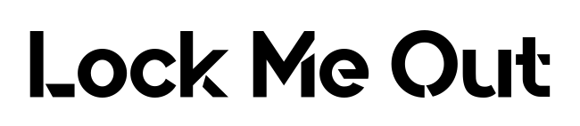
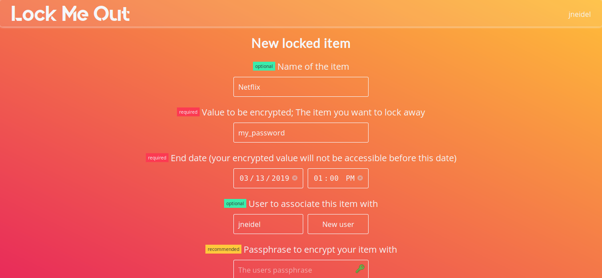
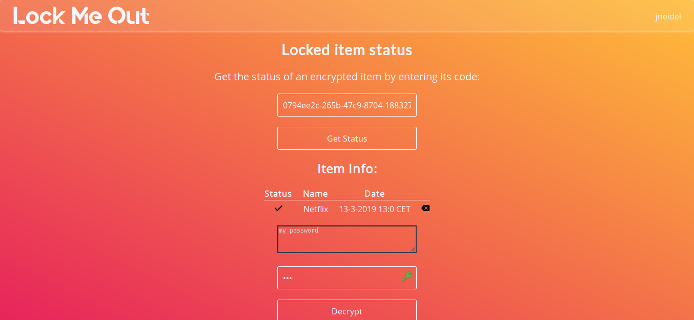

<p align="center">
    
</p>

> Temporarily lock yourself out of a service by encrypting e.g. your netflix password for a week


[](https://github.com/jneidel/lock-me-out/blob/master/license)
<!--[](https://github.com/jneidel/lock-me-out/releases)-->

Encrypt a string to make it inaccessible for a given amount of time.

For example: if you need to focus on your studies the upcoming week, you could take your netflix password out of your password manager and lock it away for one week. After that week you will be able to extract the password again.

> [View app](https://lmo.jneidel.com)

## Features

- Make strings inaccessible
- Group items in user account
- No login
- Generate own encryption key
- Secure encryption using [GPG](https://gnupg.org/)

## Screenshots

<p align="center">
  
  <p align="center">Create a new item</p>
</p>
<br>
<p align="center">
  
  <p align="center">Decrypt the created item</p>
</p>


## Usage

- [new item](https://lmo.jneidel.com/new) - Create a new item
- [new user](https://lmo.jneidel.com/new-user) - Create a new user
- [status](https://lmo.jneidel.com/status) - Get all items of a user or decrypt an item

## How it works

For every item that is created WITH a passphrase a new [encryption key](https://en.wikipedia.org/wiki/Public-key_cryptography) will be generated and the passed value (i.e. what you want to lock up, e.g. password) will be encrypted with that key.
The user now has the passphrase with which their item has been encrypted, without this passphrase the item can't be decrypted. This also means that I (i.e. the admin) can't access the encrypted data, as I don't know the users passphrase.

Items WITHOUT a password are encrypted with a shared keypair (the passphrase is written down in cleartext!). This should be avoided for real use, as this means that I (i.e. the admin) am able to access whatever the user encrypted!

User accounts will also generate an encryption key, which will be shared among it's items.

## Installation

- Clone the repo
- Copy `.env.example` to `.env`
- Fill in `.env`
- Run `npm install`
- Run `npm run build`
- Run `npm run start-prod` or `npm run start`

### Dependencies

**`gpg - 2.x`:**

GnuPG is required for the encryption of items.

See [lock-me-out-cli](https://github.com/jneidel/lock-me-out-cli/blob/master/bin/install-gpg.sh) for a gpg install script.

Once installed you can test if gpg is working as intended with: `npm run test gpg`

## Test

```
$ npm run test
```

## Related

- [jneidel/lock-me-out-cli](https://github.com/jneidel/lock-me-out-cli): CLI of this module
- [jneidel/lock-me-out-api](https://github.com/jneidel/lock-me-out-api): API for this module

## Attribution

**Fonts**

- [Lato](https://fonts.google.com/specimen/Lato)
- [Open Sans](https://fonts.google.com/specimen/Open+Sans)
- [Quantify](https://www.dafont.com/quantify.font)

**Icons**

- [Trash can](https://www.flaticon.com/free-icon/backspace-arrow_61167)
- [Check](https://www.flaticon.com/free-icon/checked_128384)
- [Cross](https://www.flaticon.com/free-icon/cancel_128397)
- [Lock closed](https://www.flaticon.com/free-icon/padlock_159435)
- [Lock open](https://www.flaticon.com/free-icon/padlock_159457)
- [Github](https://www.flaticon.com/free-icon/github-logo_25231)

## Privacy Policy

Only data needed for the usage of the app is being retained:

**Item data:**
- name of the item, if given
- encrypted value, not readable ([see](https://github.com/jneidel/lock-me-out#how-it-works))
- end date
- associated user

Items can be permanently removed on the [status page](https://lmo.jneidel.com/status).

**User data:**

- username

There is no logging.

Cookies only keep a link to the user in the top right corner.

## License

MIT © [Jonathan Neidel](https://jneidel.com)
