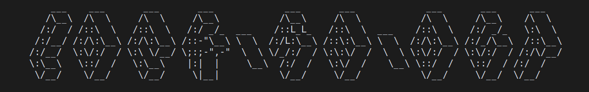

<h1 align="center">
    
</h1>

> Temporarily lock yourself out of a service by encrypting e.g. your netflix password for a week


[](https://github.com/jneidel/lock-me-out/blob/master/license)

<!--[](https://github.com/jneidel/lock-me-out/releases)-->

<!--Description

## Features

> [View app]( URL )

## Usage

## Installation
-->

## Dependencies

**`gpg - 2.x`:**

GnuPG is required for the encryption of items.

See [lock-me-out-cli](https://github.com/jneidel/lock-me-out-cli/blob/master/bin/install-gpg.sh) for a gpg install script.

Once installed you can test if gpg is working as intended with: `npm run test gpg`

## Test

```
$ npm run test
```

## Attribution

**Fonts**

- [Lato](https://fonts.google.com/specimen/Lato)
- [Open Sans](https://fonts.google.com/specimen/Open+Sans)
- [Quantify](https://www.dafont.com/quantify.font)

**Icons**

- [Trash can](https://www.flaticon.com/free-icon/backspace-arrow_61167)
- [Check](https://www.flaticon.com/free-icon/checked_128384)
- [Cross](https://www.flaticon.com/free-icon/cancel_128397)
- [Lock closed](https://www.flaticon.com/free-icon/padlock_159435)
- [Lock open](https://www.flaticon.com/free-icon/padlock_159457)
- [Github](https://www.flaticon.com/free-icon/github-logo_25231)

## Related

- [jneidel/lock-me-out-cli](https://github.com/jneidel/lock-me-out-cli): CLI of this module
- [jneidel/lock-me-out-api](https://github.com/jneidel/lock-me-out-api): API for this module

## License

MIT © [Jonathan Neidel](https://jneidel.com)
